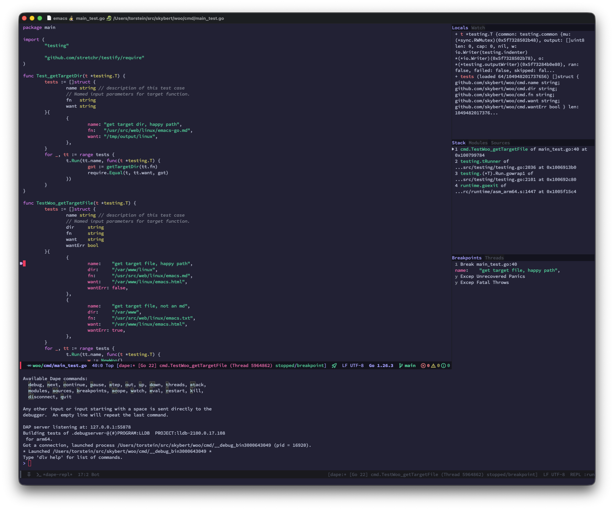
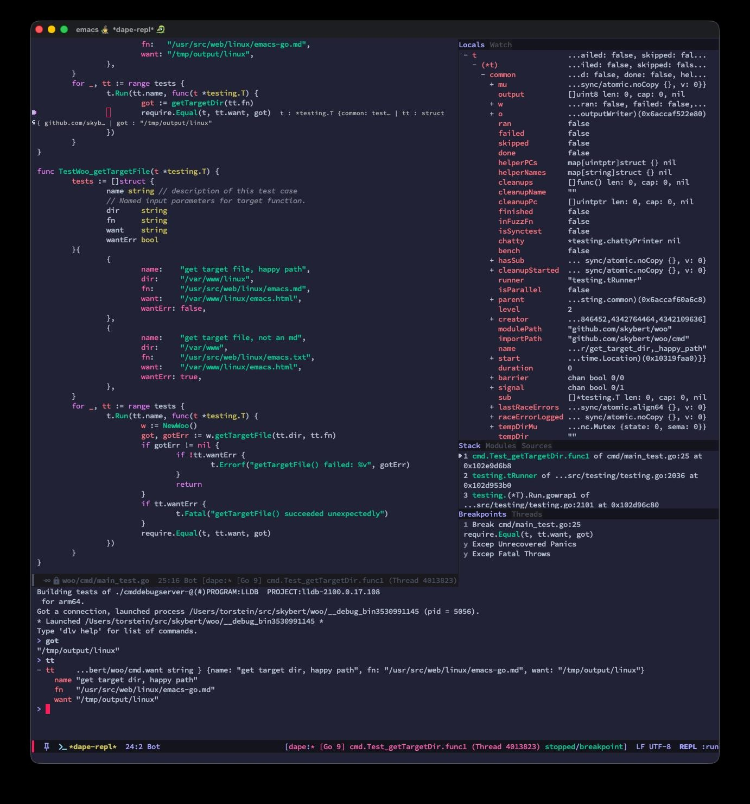

# My debugger

---

---

# Wanted two improvements

1. Improved debugger layout
2. Single key navigation

---

# Claude

- [Opus 4.7 model](https://www.anthropic.com/news/claude-opus-4-7).
- Gave it the full source code to the correct version of the debugger.
- Gave it my current Emacs configuration
- Gave it an elaborate prompt explaining each scenario, `/clear`ing
  the context when it was running on empty.
- Tested, re-prompted, tested again.
- Spent at least two hours

---

# My improved debugger

---

---

# Great!

Problem solved.

---

# ...but what about the code?

---

# Improved debugger layout

- [dape-layout-ai.el](dape-layout-ai.el)
- [dape-layout-me.el](dape-layout-me.el)

---

# Single key navigaiton

- [dape-single-key-nav-ai.el](dape-single-key-nav-ai.el)
- [dape-single-key-nav-me.el](dape-single-key-nav-me.el)

---
