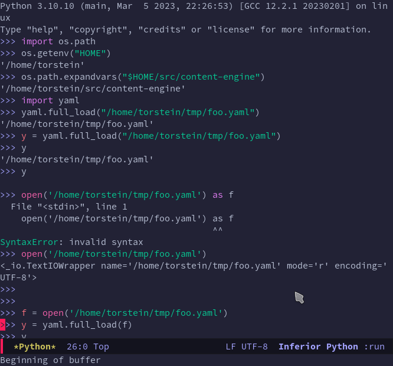

## Agenda

- Emacs (editor)
- Pyright (server)
- Eglot (client)

---

## pyright - easy

```text
$ pip3 install pyright
```

---

or...

---

## pyright - project deps

See project dependencies from `Pipfile` and `setup.cf`:

---

## pyright - project deps

```text
$ pipenv shell
$ pip3 install pyright
$ emacs &
```

---

## pyright

```text
$ pstree -a -p $(pgrep pyright)
```

---

## eglot

Couldn't get any of the Python LSP modes to work in my Emacs 28.2

---

## eglot

Worked out of the box, just with:

```text
M-x eglot
```

---

## eglot

- auto completion
- warnings
- navigation
- IDE features, like `rename`

---

## eglot

```
M-x package-install RET eglot
```

---

## eglot 

Will be built-in with Emacs 29.x 🎉

---

## Integrated Python shell 

- auto completion
- syntax highlight

---




---

## Summary

---

## Delve further

- [pyright](https://pypi.org/project/pyright/)
- [eglot](https://github.com/joaotavora/eglot)
