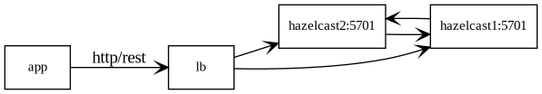
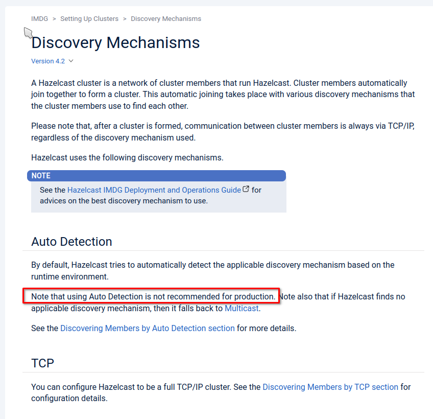

## Agenda

- Hazelcast: awesome in-memory database
- Install a cluster from scratch
- Enable REST interface

---

## Architecture



---

```xml
# apt-get install hazelcast
```

---

## Hazelcast has awesome auto discovery

---

## However ...

---



---

## Find the IP for the Hazelcast traffic

```text
$ ip a
..
2: enp1s0: <BROADCAST,MULTICAST,UP,LOWER_UP> mtu 1500 qdisc fq_codel state UP group default qlen 1000
    link/ether 52:54:00:cc:70:a6 brd ff:ff:ff:ff:ff:ff
    inet 192.168.122.100/24 brd 192.168.122.255 scope global enp1s0
       valid_lft forever preferred_lft forever
    inet6 fe80::5054:ff:fecc:70a6/64 scope link
       valid_lft forever preferred_lft forever
```

---

## Let's configure Hazelcast

```text
# vim /usr/lib/hazelcast/config/hazelcast.xml
```

---

```xml
<hazelcast>
  <network>
    <interfaces enabled="true">
      <interface>192.168.122.100</interface>
    </interfaces>
```

---

```xml
<hazelcast>
  <network>
    <join>
      <tcp-ip enabled="true">
        <member-list>
          <member>192.168.122.100</member>
          <member>192.168.122.101</member>
        </member-list>
      </tcp-ip>
```

---

```xml
<hazelcast>
  <network>
    <rest-api enabled="true">
      <endpoint-group name="DATA" enabled="true"/>
```

---

## Start the Hazelcasts

```text
# systemctl enable hazelcast
# systemctl start hazelcast
```

---

## Verify the Hazelcasts can find eachother

```text
$ journalctl -u hazelcast -f
..
Members {size:2, ver:2} [
        Member [192.168.122.100]:5701 - 76114324-f56e-426b-993a-9bc124b3ba1d
        Member [192.168.122.101]:5701 - e8343172-21c4-4887-b972-eb39a4eaa0cd this
]
```

---

## Test drive your Hazelcast cluster

---

## Create some content in one Hazelcast

```text
$ curl \
  --include \
  --header "Content-Type: text/plain" \
  --data "Hello world!" \
  http://192.168.122.100:5701/hazelcast/rest/maps/mapName/foo
```

---

## Query both Hazelcasts

```text
$ curl \
  http://192.168.122.100:5701/hazelcast/rest/maps/mapName/foo
Hello world!
$ curl \
  http://192.168.122.101:5701/hazelcast/rest/maps/mapName/foo
Hello world!
```

---

## Summary

- Don't use auto discovery in production
- Use "TCP discovery"
- Only bind to one interface
- Use the bind interface in the member list

---

## Delve further

- Hazelcast docs on [Discovering Members by TCP](https://docs.hazelcast.com/imdg/4.2/clusters/discovering-by-tcp)
