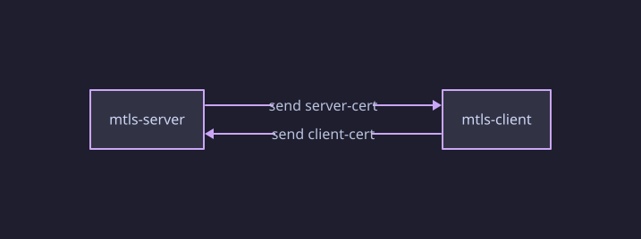
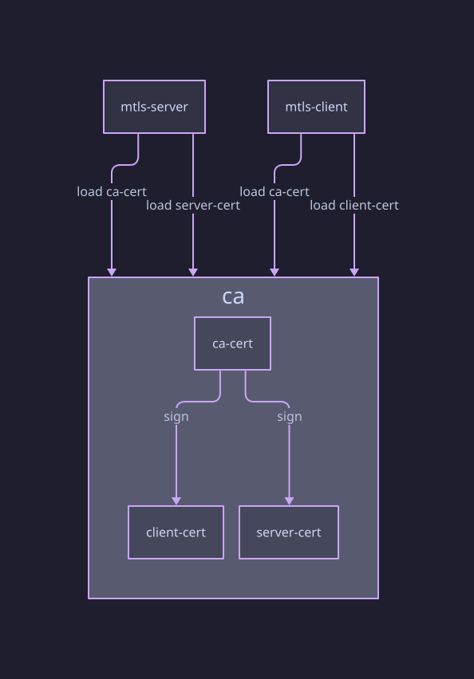

## Agenda

- What's mTLS
- Create our own CA
- Create our own server and client certifates
- Build an mTLS server in Go
- Make Firefox accept our CA
- Make Firefox identify itself with a certificate

---

## What's mTLS

---

---

---

## Create our own CA

---

## Create our own server and client certifates

---

## Build an mTLS server in Go

---

## Make Firefox accept our CA

---

## Make Firefox identify itself with a certificate

---

## Summary

- [openssl](https://docs.openssl.org/master/man1/openssl/)
- [RFC 9846: The Transport Layer Security (TLS) Protocol Version 1.3](https://www.rfc-editor.org/info/rfc9846/)

---

## Delve further
